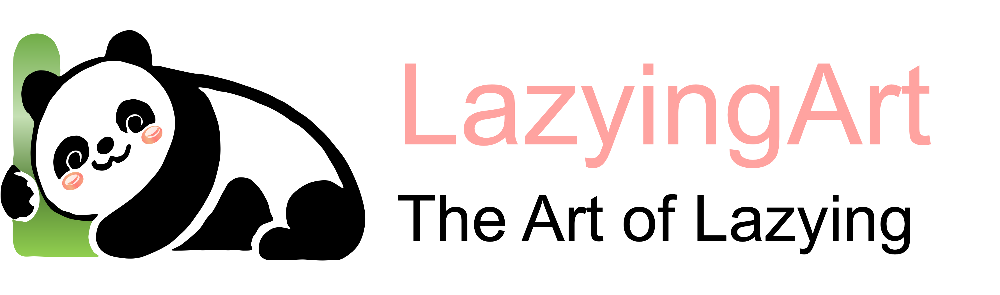

[English](README.md) · [العربية](i18n/README.ar.md) · [Español](i18n/README.es.md) · [Français](i18n/README.fr.md) · [日本語](i18n/README.ja.md) · [한국어](i18n/README.ko.md) · [Tiếng Việt](i18n/README.vi.md) · [中文 (简体)](i18n/README.zh-Hans.md) · [中文（繁體）](i18n/README.zh-Hant.md) · [Deutsch](i18n/README.de.md) · [Русский](i18n/README.ru.md)

# Lachlan Chen · 陈荣周（苗）

*Quad tango muto*

Personal site and CV of **Lachlan (Rongzhou) Chen**: PhD candidate in neuromorphic imaging at the University of Hong Kong, Creator & CEO of **LazyingArt LLC**, Cofounder & COO of **LightMind Tech Ltd**.

**Live:** <https://lachlanchen.lazying.art> (GitHub Pages, custom domain; also <https://lachlanchen.github.io>)

| Page | What is there |
| --- | --- |
| [About](https://lachlanchen.lazying.art/) | Bio, focus, highlights, companies, support |
| [Publications](https://lachlanchen.lazying.art/publications.html) | Papers by year, preprints, patents |
| [Projects](https://lachlanchen.lazying.art/projects.html) | Open-source tools and hardware with demo images |
| [CV](https://lachlanchen.lazying.art/cv.html) | Web CV plus one-page PDFs in [English](cv/Lachlan_Chen_CV_en.pdf) and [中文](cv/Lachlan_Chen_CV_zh.pdf) |

The site is plain HTML/CSS/JS, no build step. The EN / 中文 switch in the top bar is client-side (`assets/js/site.js`); publications and patents stay in English in both languages. The `i18n/` folder carries the multilingual profile READMEs so the language header above resolves.

## Focus

- The Art of Lazying: build less, unlock more life
- Automation systems for creator and research workflows
- Multilingual speech and learning tools
- Imaging, optics, and embodied AI

## Support

| Donate | PayPal | Stripe |
| --- | --- | --- |
|  |  |  |

## Editing

- Text for both languages lives in `assets/js/site.js` (`I18N.en`, `I18N.zh`); page structure in the four `.html` files.
- The PDFs in `cv/` are built from `ProjectsLFS/CV/LazyingArt_VisionProfile_2026/` with XeLaTeX (`python3 make_zh.py && xelatex …`, twice).
- `CNAME` pins the custom domain `lachlanchen.lazying.art`; `.nojekyll` serves the files as-is.

## Contact

Build less. Live more.
